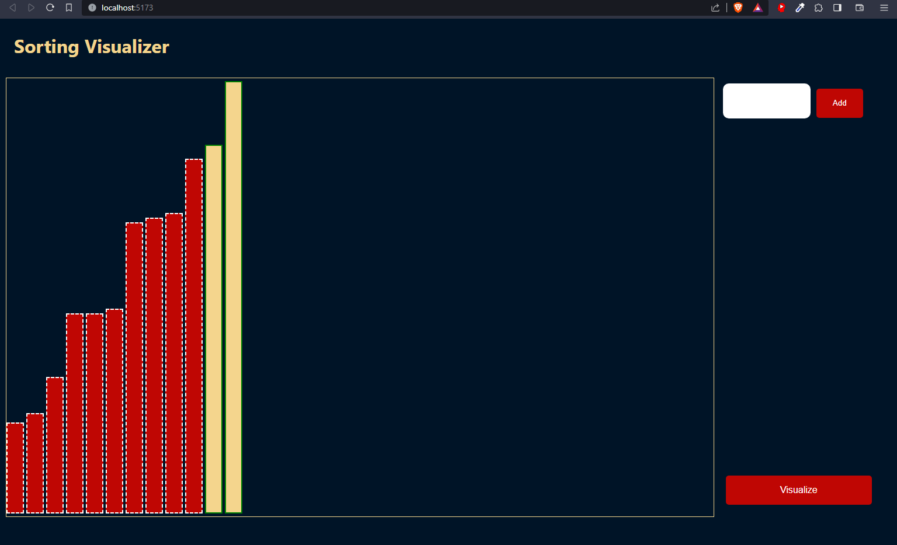

# Sorting Visualizer 🧮



Welcome to the Sorting Visualizer! This project allows you to visualize various sorting algorithms in action, making it easier to understand how they work and how efficient they are.

## Features 🚀

- Choose from various sorting algorithms like Bubble Sort, Quick Sort, Merge Sort, and more.
- Customize array size and animation speed for a tailored experience.
- Watch the algorithm's step-by-step execution and learn in an interactive way.
- Responsive design for seamless use on desktop and mobile devices.

## Live Demo 🌐

Check out the live demo [here](https://your-sorting-visualizer-url.com).

## Getting Started 🏁

1. Clone the repository:

   ```bash
   git clone https://github.com/Mohit9925/sorting-visualizer.git
